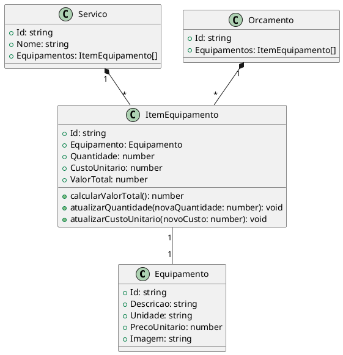

# 🛠️ Entidades Equipamento e ItemEquipamento

Documentação das entidades **Equipamento** e **ItemEquipamento** do sistema eCleaner.

## 📋 Visão Geral

O módulo de **Equipamento** gerencia os equipamentos utilizados na prestação de serviços de limpeza, como aspiradores industriais, lavadoras de alta pressão, enceradeiras, etc. A entidade **ItemEquipamento** representa um equipamento específico utilizado em um serviço ou orçamento.

## 🎯 Entidades

### Equipamento

Representa um equipamento disponível para uso nos serviços.

**Localização**: `src/core/domain/entities/equipamento.js`

#### Propriedades

| Propriedade     | Tipo     | Descrição                               |
| --------------- | -------- | --------------------------------------- |
| `Id`            | `string` | GUID único do equipamento               |
| `Descricao`     | `string` | Descrição/nome do equipamento           |
| `Unidade`       | `string` | Unidade de medida (hora, dia, un, etc.) |
| `PrecoUnitario` | `number` | Preço unitário do aluguel/uso           |
| `Imagem`        | `string` | URL ou base64 da imagem do equipamento  |

#### Construtor

```javascript
constructor(descricao, unidade, precoUnitario, (imagem = ''))
```

#### Exemplo de Uso

```javascript
import Equipamento from '@/core/domain/entities/equipamento'

const equipamento = new Equipamento(
  'Aspirador Industrial 1600W',
  'hora',
  50.0,
  'data:image/jpeg;base64,...',
)

console.log(equipamento.Id) // GUID gerado automaticamente
console.log(equipamento.Descricao) // "Aspirador Industrial 1600W"
console.log(equipamento.PrecoUnitario) // 50.00
```

---

### ItemEquipamento

Representa um equipamento específico sendo utilizado em um serviço ou orçamento, incluindo quantidade e cálculo de valor.

**Localização**: `src/core/domain/entities/itemEquipamento.js`

#### Propriedades

| Propriedade     | Tipo          | Descrição                                          |
| --------------- | ------------- | -------------------------------------------------- |
| `Id`            | `string`      | GUID único do item                                 |
| `Equipamento`   | `Equipamento` | Referência ao equipamento                          |
| `Quantidade`    | `number`      | Quantidade do equipamento                          |
| `CustoUnitario` | `number`      | Custo unitário (pode diferir do preço cadastrado)  |
| `ValorTotal`    | `number`      | Valor total calculado (Quantidade × CustoUnitario) |

#### Construtor

```javascript
constructor(equipamento, quantidade, custoUnitario)
```

**Validações**:

- `equipamento` deve ser uma instância de `Equipamento`
- `quantidade` deve ser maior que 0
- `custoUnitario` deve ser maior ou igual a 0

#### Métodos

##### `calcularValorTotal()`

Calcula e retorna o valor total do item.

```javascript
calcularValorTotal(): number
```

**Retorno**: `Quantidade × CustoUnitario`

##### `atualizarQuantidade(novaQuantidade)`

Atualiza a quantidade e recalcula o valor total.

```javascript
atualizarQuantidade(novaQuantidade: number): void
```

**Validação**: `novaQuantidade` deve ser maior que 0

##### `atualizarCustoUnitario(novoCusto)`

Atualiza o custo unitário e recalcula o valor total.

```javascript
atualizarCustoUnitario(novoCusto: number): void
```

**Validação**: `novoCusto` deve ser maior ou igual a 0

#### Exemplo de Uso

```javascript
import Equipamento from '@/core/domain/entities/equipamento'
import ItemEquipamento from '@/core/domain/entities/itemEquipamento'

// Criar equipamento
const equipamento = new Equipamento('Lavadora Alta Pressão', 'dia', 80.0)

// Criar item de equipamento
const item = new ItemEquipamento(
  equipamento,
  2, // Quantidade: 2 dias
  80.0, // Custo unitário: R$ 80,00
)

console.log(item.ValorTotal) // 160.00

// Atualizar quantidade
item.atualizarQuantidade(3)
console.log(item.ValorTotal) // 240.00

// Atualizar custo
item.atualizarCustoUnitario(70.0)
console.log(item.ValorTotal) // 210.00
```

---

## 🗂️ Estrutura de Arquivos

```
src/core/domain/entities/
├── equipamento.js           # Entidade Equipamento
└── itemEquipamento.js       # Entidade ItemEquipamento

src/core/infrastructure/repositories/
├── equipamentoRepository.js # Repositório (localStorage)
└── seeds/
    └── equipamentoSeed.js   # Dados iniciais de equipamentos

src/stores/
└── equipamento-store.js     # Pinia store para gerenciamento de estado

src/pages/
├── EquipamentoCadastroPage.vue  # Formulário de cadastro/edição
└── EquipamentoListagemPage.vue  # Lista de equipamentos

src/i18n/
├── pt-BR/index.js          # Traduções em português
└── en-US/index.js          # Traduções em inglês
```

---

## 🔄 Relacionamentos

### Diagrama de Classes



### Relacionamentos

- **Equipamento → ItemEquipamento**: Um equipamento pode ser usado em vários itens (1:N)
- **Servico → ItemEquipamento**: Um serviço pode ter vários equipamentos (1:N)
- **Orcamento → ItemEquipamento**: Um orçamento pode ter vários equipamentos (1:N)

---

## 💾 Persistência

### Repository Pattern

O **EquipamentoRepository** gerencia a persistência em `localStorage`:

```javascript
import EquipamentoRepository from '@/core/infrastructure/repositories/equipamentoRepository'

// Criar
const equipamento = new Equipamento('Enceradeira', 'hora', 45.0)
await EquipamentoRepository.create(equipamento)

// Listar todos
const equipamentos = await EquipamentoRepository.getAll()

// Buscar por ID
const equipamento = await EquipamentoRepository.getById(id)

// Atualizar
equipamento.PrecoUnitario = 50.0
await EquipamentoRepository.update(equipamento)

// Deletar
await EquipamentoRepository.delete(id)

// Buscar por descrição
const resultados = await EquipamentoRepository.searchByDescricao('aspirador')
```

**Chave localStorage**: `equipamentos`

---

## 📊 Store (Pinia)

### Equipamento Store

**Localização**: `src/stores/equipamento-store.js`

#### Estado

```javascript
state: {
  Equipamentos: [],
  Loading: false,
  Error: null
}
```

#### Actions

| Action                      | Descrição                      |
| --------------------------- | ------------------------------ |
| `loadEquipamentos()`        | Carrega todos os equipamentos  |
| `addEquipamento(data)`      | Adiciona novo equipamento      |
| `updateEquipamento(data)`   | Atualiza equipamento existente |
| `deleteEquipamento(id)`     | Remove equipamento             |
| `getEquipamentoById(id)`    | Busca equipamento por ID       |
| `searchEquipamentos(termo)` | Busca por descrição            |

#### Getters

| Getter                  | Descrição                             |
| ----------------------- | ------------------------------------- |
| `TotalEquipamentos`     | Quantidade total de equipamentos      |
| `EquipamentosOrdenados` | Lista ordenada alfabeticamente        |
| `HasEquipamentos`       | Indica se há equipamentos cadastrados |
| `IsLoading`             | Indica se está carregando             |
| `HasError`              | Indica se há erro                     |

#### Exemplo de Uso

```javascript
import { useEquipamentoStore } from '@/stores/equipamento-store'

const store = useEquipamentoStore()

// Carregar equipamentos
await store.loadEquipamentos()

// Adicionar novo
await store.addEquipamento({
  Descricao: 'Politriz',
  Unidade: 'hora',
  PrecoUnitario: 35.0,
  Imagem: '',
})

// Buscar
const resultados = store.searchEquipamentos('aspirador')

// Acessar getters
console.log(store.TotalEquipamentos)
console.log(store.EquipamentosOrdenados)
```

---

## 🎨 Interface

### Páginas

#### EquipamentoListagemPage.vue

Lista todos os equipamentos com funcionalidades de:

- ✅ Busca/filtro por descrição ou unidade
- ✅ Visualização em tabela (desktop) ou cards (mobile)
- ✅ Editar equipamento
- ✅ Excluir equipamento
- ✅ Botão "Novo Equipamento"

#### EquipamentoCadastroPage.vue

Formulário de cadastro/edição com:

- ✅ Campos: Descrição, Preço Unitário, Unidade
- ✅ Upload de imagem (máx 5MB)
- ✅ Preview da imagem
- ✅ Validações de campos obrigatórios
- ✅ Formatação de moeda (internacionalizada)
- ✅ Modo criação e edição

---

## 🌐 Internacionalização (i18n)

### Chaves de Tradução

#### pages.equipamento

```javascript
pages: {
  equipamento: {
    title: 'Equipamentos' | 'Equipment',
    subtitle: 'Gerencie os equipamentos...' | 'Manage equipment...',
    newButton: 'Novo Equipamento' | 'New Equipment',
    searchPlaceholder: 'Buscar equipamento...' | 'Search equipment...',
    noData: 'Nenhum equipamento encontrado' | 'No equipment found',
    fields: {
      descricao: 'Descrição' | 'Description',
      unidade: 'Unidade' | 'Unit',
      precoUnitario: 'Preço Unitário' | 'Unit Price',
      imagem: 'Imagem' | 'Image'
    },
    messages: {
      saveSuccess: 'Equipamento salvo com sucesso!' | 'Equipment saved successfully!',
      deleteSuccess: 'Equipamento excluído!' | 'Equipment deleted!',
      // ... outras mensagens
    }
  }
}
```

#### forms.equipamento

```javascript
forms: {
  equipamento: {
    newTitle: 'Novo Equipamento' | 'New Equipment',
    editTitle: 'Editar Equipamento' | 'Edit Equipment',
    sections: {
      equipmentData: 'Dados do Equipamento' | 'Equipment Data',
      imagePreview: 'Visualização da Imagem' | 'Image Preview'
    },
    // ... outros campos
  }
}
```

---

## 🧪 Testes

### Testes Unitários

**Localização**: `tests/unit/domain/entities/`

#### itemEquipamento.spec.js

```javascript
describe('ItemEquipamento', () => {
  it('deve criar item com valores corretos', () => {
    const equipamento = new Equipamento('Aspirador', 'hora', 50)
    const item = new ItemEquipamento(equipamento, 2, 50)

    expect(item.Quantidade).toBe(2)
    expect(item.ValorTotal).toBe(100)
  })

  it('deve validar quantidade mínima', () => {
    const equipamento = new Equipamento('Aspirador', 'hora', 50)

    expect(() => {
      new ItemEquipamento(equipamento, 0, 50)
    }).toThrow('Quantidade deve ser maior que zero')
  })

  it('deve atualizar quantidade e recalcular total', () => {
    const equipamento = new Equipamento('Aspirador', 'hora', 50)
    const item = new ItemEquipamento(equipamento, 2, 50)

    item.atualizarQuantidade(3)

    expect(item.Quantidade).toBe(3)
    expect(item.ValorTotal).toBe(150)
  })
})
```

---

## 🚀 Seeds

### Dados Iniciais

**Localização**: `src/core/infrastructure/repositories/seeds/equipamentoSeed.js`

15 equipamentos pré-cadastrados:

- Aspirador Industrial 1600W
- Lavadora Alta Pressão 2200psi
- Enceradeira Profissional
- Politriz Rotativa 1200W
- Extratora de Carpetes
- Gerador de Vapor
- Limpadora de Vidros Profissional
- Soprador Térmico Industrial
- Escada Telescópica 6m
- Carrinho de Limpeza Profissional
- Aspirador de Pó e Água 1400W
- Lavadora de Piso Industrial
- Kit Limpeza Alta Performance
- Pulverizador Elétrico 10L
- Desinfetadora Térmica ULV

### Carregar Seeds

```javascript
import { runEquipamentoSeed } from '@/core/infrastructure/repositories/seeds'

// Carregar apenas equipamentos
await runEquipamentoSeed()

// Ou carregar tudo
import { runAllSeeds } from '@/core/infrastructure/repositories/seeds'
await runAllSeeds()
```

---

## 🔗 Rotas

```javascript
// Listagem
/equipamentos

// Novo equipamento
/equipamentos/novo

// Editar equipamento
/equipamentos/:id/editar
```

---

## 📝 Notas Importantes

### Diferenças entre Material e Equipamento

| Aspecto         | Material                        | Equipamento            |
| --------------- | ------------------------------- | ---------------------- |
| **Uso**         | Consumível (ex: sabão, esponja) | Aluguel/uso temporário |
| **Unidade**     | UN, L, KG, PCT                  | hora, dia, semana      |
| **Preço**       | Venda                           | Aluguel                |
| **Estoque**     | Controle de estoque             | Não aplicável          |
| **URL Produto** | Sim                             | Não                    |

### Boas Práticas

1. ✅ Sempre validar instância de `Equipamento` antes de criar `ItemEquipamento`
2. ✅ Usar métodos `atualizarQuantidade()` e `atualizarCustoUnitario()` para manter consistência
3. ✅ Compactar imagens antes de salvar (máx 5MB)
4. ✅ Usar formatação de moeda internacionalizada
5. ✅ Sempre carregar equipamentos na store antes de usar

---

**📅 Criado em**: 27 de outubro de 2025  
**🔗 Relacionado**: [Diagrama Completo](./diagrama-classes-completo.puml)  
**📦 Versão**: 1.0.0
