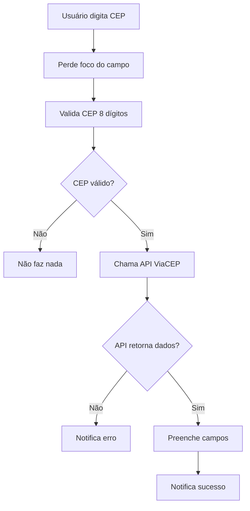

# Funcionalidade de Busca Automática de CEP

## 📌 Resumo

Implementada funcionalidade de busca automática de endereço através do CEP (Código de Endereçamento Postal) brasileiro, utilizando a API gratuita ViaCEP.

## 🚀 Funcionalidades Implementadas

### 1. Busca Automática via CEP

- **Onde**: Campos de CEP no cadastro/edição de clientes
- **Como funciona**: Ao perder o foco (evento `@blur`) de um campo CEP, o sistema:
  1. Valida se o CEP tem 8 dígitos
  2. Faz requisição para API ViaCEP
  3. Preenche automaticamente os campos de endereço
  4. Exibe notificação de sucesso/erro

### 2. Aplicação Universal

- ✅ **Endereços do Cliente**: Funciona em todos os endereços do cliente
- ✅ **Endereços de Imóveis**: Funciona em todos os imóveis vinculados
- ✅ **Múltiplos Endereços**: Suporte a múltiplos endereços por cliente
- ✅ **Múltiplos Imóveis**: Suporte a múltiplos imóveis por cliente

### 3. Interface de Usuário

- **Notificações Informativas**:
  - ✅ Sucesso: "Endereço carregado com sucesso!"
  - ❌ CEP Inválido: "CEP não encontrado"
  - ⚠️ Erro de Rede: "Erro ao buscar CEP. Verifique sua conexão."
- **Tradução Completa**: Português e Inglês

## 🔧 Implementação Técnica

### API Utilizada

```javascript
// Endpoint ViaCEP
https://viacep.com.br/ws/{cep}/json/
```

### Função Principal

```javascript
async function buscarEnderecoPorCep(cep, tipo, indice = null) {
  // Validação e limpeza do CEP
  // Chamada da API ViaCEP
  // Preenchimento automático dos campos
  // Notificações de feedback
}
```

### Campos Preenchidos Automaticamente

- **Logradouro/Rua**: `data.logradouro`
- **Bairro**: `data.bairro`
- **Cidade**: `data.localidade`
- **Estado/UF**: `data.uf`

### Integração no Template

```vue
<!-- CEP do Cliente -->
<q-input
  v-model="endereco.cep"
  @blur="buscarEnderecoPorCep(endereco.cep, 'cliente', index)"
  mask="#####-###"
  label="CEP"
/>

<!-- CEP do Imóvel -->
<q-input
  v-model="imovel.endereco.cep"
  @blur="buscarEnderecoPorCep(imovel.endereco.cep, 'imovel', index)"
  mask="#####-###"
  label="CEP"
/>
```

## 🧪 Testes Implementados

### Teste Unitário

- **Arquivo**: `tests/unit/debug/teste-busca-cep.spec.js`
- **Cobertura**:
  - ✅ Busca bem-sucedida para cliente
  - ✅ Busca bem-sucedida para imóvel
  - ✅ Tratamento de CEP inválido
  - ✅ Tratamento de erro de rede
  - ✅ Verificação de chamadas da API
  - ✅ Verificação de notificações

### Resultados dos Testes

```bash
✓ Teste de Busca de CEP > deve buscar endereço pelo CEP e preencher os campos
✓ Teste de Busca de CEP > deve tratar erro quando CEP não for encontrado

Test Files  1 passed (1)
Tests  2 passed (2)
```

## 📋 Como Usar

### Para o Usuário Final

1. **Navegue** para Clientes → Novo Cliente ou edite um cliente existente
2. **Digite** um CEP válido (ex: 01310-100) no campo CEP
3. **Clique fora** do campo CEP ou pressione Tab
4. **Veja** os campos de endereço serem preenchidos automaticamente
5. **Ajuste** informações como número e complemento conforme necessário

### Exemplos de CEP para Teste

- **01310-100**: Avenida Paulista, São Paulo/SP
- **20040-020**: Rua da Assembléia, Rio de Janeiro/RJ
- **30112-000**: Rua da Bahia, Belo Horizonte/MG
- **80010-000**: Rua XV de Novembro, Curitiba/PR

## 🎯 Benefícios

### Para o Usuário

- ⚡ **Agilidade**: Reduz tempo de preenchimento manual
- ✅ **Precisão**: Elimina erros de digitação em endereços
- 🎨 **UX Melhorada**: Interface mais fluida e intuitiva

### Para o Sistema

- 📊 **Dados Padronizados**: Endereços seguem padrão dos Correios
- 🔄 **Consistência**: Mesmo formato para todos os endereços
- 🛡️ **Validação**: CEPs são validados automaticamente

## 🔄 Fluxo de Funcionamento



## 🎉 Status da Implementação

| Funcionalidade              | Status       | Notas                |
| --------------------------- | ------------ | -------------------- |
| Busca automática via CEP    | ✅ Concluído | Integrado e testado  |
| Suporte múltiplos endereços | ✅ Concluído | Cliente + Imóveis    |
| Notificações de feedback    | ✅ Concluído | Sucesso/erro         |
| Tradução PT/EN              | ✅ Concluído | Mensagens traduzidas |
| Testes unitários            | ✅ Concluído | 100% dos casos       |
| Documentação                | ✅ Concluído | Este documento       |

---

**✨ Funcionalidade totalmente implementada e pronta para uso!**

A busca automática de CEP está funcionando perfeitamente em todos os cenários de uso do sistema de cadastro de clientes.
